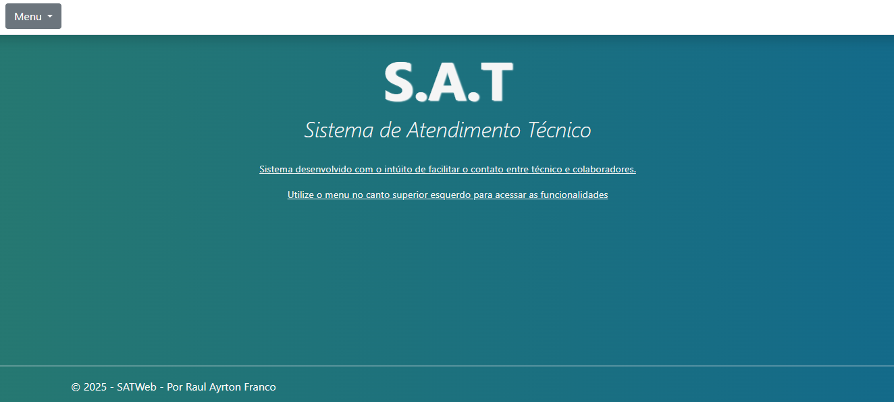

# 👨‍💻 Portfólio - Raul Ayrton Franco

Bem-vindo ao meu portfólio pessoal! Aqui você encontra meus projetos, habilidades e contatos.

---

## 📖 Sobre o Projeto

Site de portfólio pessoal para apresentar minha trajetória acadêmica e profissional, projetos desenvolvidos e formas de contato.  

**Objetivo:** Mostrar minhas habilidades e experiências de forma clara e atrativa para recrutadores e colaboradores.

---

## 🛠 Tecnologias

- **HTML5 / CSS3 / Bootstrap** – Estrutura e layout responsivo  
- **JavaScript** – Interatividade  
- **ScrollReveal.js** – Animações de rolagem  
- **Git** – Controle de versão  

---

## 👨‍🎓 Sobre Mim

- **Nome:** Raul Ayrton Franco  
- **Idade:** 31 anos  
- **Formação:** 1º semestre de Análise e Desenvolvimento de Sistemas (Gran Faculdade) | Técnico em Informática para Internet (SENAC)  
- **Área de Interesse:** Desenvolvimento Fullstack  
- **Perfil:** Curioso, dedicado, proativo e comunicativo  

---

## 🛠 Habilidades

- **Linguagens:** C#, JavaScript  
- **Mobile:** React Native  
- **Front-end:** HTML, CSS, Bootstrap  
- **Banco de Dados:** MySQL, SQLite, PostgreSQL  
- **Versionamento:** Git  

---

## 💻 Projetos

### Sistema de Atendimento Técnico (SAT)

- **Descrição:** Plataforma web para gestão de solicitações de suporte técnico (tickets, chamados, OS).  
- **Tecnologias:** .NET C#, HTML, CSS, JavaScript  
- **Motivação:** Resolver problemas reais de alta demanda em suporte técnico.  
- **Imagem do Projeto:**  


[🔗 Confira o projeto](#)

---

## 📱 Contatos e Redes

- [GitHub](https://github.com/RAFranc0)  
- [LinkedIn](https://www.linkedin.com/in/raul-ayrton-franco-589b0a1b3/)  
- [Instagram](https://www.instagram.com/raulayrton)  
- [WhatsApp](https://wa.me/5516996482128)  
- **E-mail:** raul.franco266@gmail.com

---

## ⚙ Funcionalidades do Site

- Menu de navegação fixo: Sobre | Projetos | Contatos  
- Carrossel interativo para projetos  
- Animações suaves com ScrollReveal  
- Botão de download/visualização do currículo  
- Copiar e-mail rapidamente com clique  

---

## 🚀 Como Rodar

1. Clone o repositório:  
```bash
git clone https://github.com/RAFranc0/portfolio.git
